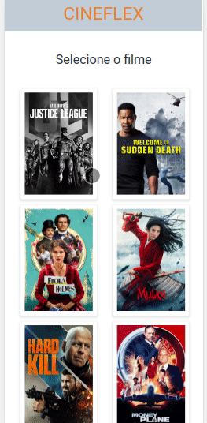

# CINEFLEX

<p align="center">
  
  
  <a href="https://github.com/yaratavares/CineFlex/commits/main">
    
  </a>
   </p>

<p align="center">
 <a href="#-sobre-o-projeto">Projeto</a> •
 <a href="#-funcionalidades">Funcionalidades</a> •
 <a href="#-layout">Layout</a> • 
 <a href="#-tecnologias">Tecnologias</a> • 
  <a href="#-executar">Executar</a> • 
 <a href="#-autor">Autor</a> • 
 <a href="#user-content--licença">Licença</a>
</p>

## 💻 Projeto

🎬 Cineflex - é um website em que o usuário pode agendar uma sessão de cinema no conforto de sua casa, trazendo mais praticidade e tecnologia para o seu lazer.

Nono projeto desenvolvido no curso de Full-Stack Developer na [Driven Education](https://www.driven.com.br/).

---

## ⚙️ Funcionalidades

- O usuário pode reservar uma sessão de cinema através dos seguintes passos:
  - [x] assim que o usuário entra no site são listados todos os filmes que estão em cartaz
  - [x] ao clicar em um filme, o usuário deve ser redirecionado para a página "/sessoes/(idFilme)", sendo (idFilme) o id do filme clicado, onde são exibidos os horários
  - [x] ao clicar em uma sessão, o usuário deve ser redirecionado para a rota "/assentos/(idSessao)", onde (dSessao) é o id da sessão escolhida, os assentos podem estar:
    - indisponíveis
    - disponíveis
  - [x] quando for escolhido um assento disponível ele será selecionado, pode-se escolher mais de um
  - [x] não sendo obrigatório inserir o nome e cpf, poderá clicar em "Reservar assento(s)", o usuário será redirecionado para a rota "/sucesso". Isso fará com os assentos marcados fiquem indisponíveis para outras marcações.
  - [x] nesta tela poderá retornar para página inicial com a listagem de filmes
  - [x] a todo momento, exceto na página inicial pode-se retornar para página anterior com o botão "voltar"

---

## 🎨 Layout

O layout somente para Mobile da aplicação está disponível no Figma:

<a href="https://www.figma.com/file/aFVjUNt5ucXZariczg8lqA/Cineflex?node-id=3%3A7">

</a>

### Mobile

  

---

## 🚀 Como executar o projeto

Você pode somente acessar a [página](https://cine-flex-6mjztqmkd-yaratavares.vercel.app/) ou instalar na sua máquina como seguem as instruções a seguir:

### Pré-requisitos

Antes de começar, você vai precisar ter instalado em sua máquina as seguintes ferramentas:
[Git](https://git-scm.com), [Node.js](https://nodejs.org/en/).
Além disto é bom ter um editor para trabalhar com o código como [VSCode](https://code.visualstudio.com/)

#### 🧭 Rodando a aplicação web (Front-end)

```bash
# Clone este repositório
$ git clone git@github.com:yaratavares/CineFlex.git
# Vá para a pasta da aplicação e instale as dependências
$ npm install
# Execute a aplicação em modo de desenvolvimento
$ npm run start
# A aplicação será aberta na porta:3000 - acesse http://localhost:3000
```

---

## 🛠 Tecnologias

As seguintes ferramentas foram usadas na construção do projeto:

#### **Mobile** ([React](https://reactjs.org/))

- **[React Dom](https://www.npmjs.com/package/react-dom)**
- **[React Router Dom](https://github.com/ReactTraining/react-router/tree/master/packages/react-router-dom)**
- **[Axios](https://github.com/axios/axios)**

> Veja o arquivo [package.json](https://github.com/yaratavares/CineFlex/package.json)

## Cloud Architecture
ADD DIAGRAM PNG

---

## 🧜‍♀️ Autora

<a href="https://www.linkedin.com/in/yaracristinatavares/" >
 
 <p>Yara Tavares 🚀</p>
</a>
  
---

## 📝 Licença

Este projeto esta sobe a licença [MIT](./LICENSE).

aa